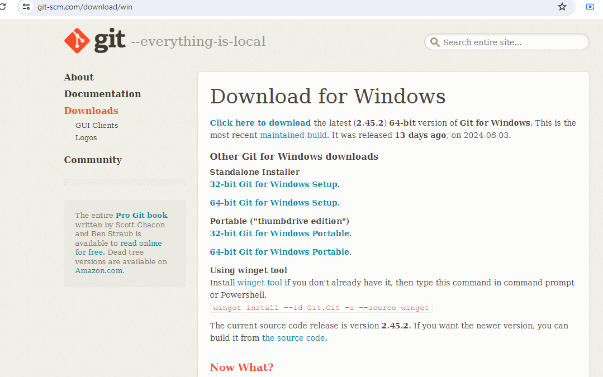

# Dev_Setup
Setup Development Environment

#Assignment: Setting Up Your Developer Environment

#Objective:
This assignment aims to familiarize you with the tools and configurations necessary to set up an efficient developer environment for software engineering projects. Completing this assignment will give you the skills required to set up a robust and productive workspace conducive to coding, debugging, version control, and collaboration.

#Tasks:

1. Select Your Operating System (OS):
   Choose an operating system that best suits your preferences and project requirements. Download and Install Windows 11. https://www.microsoft.com/software-download/windows11

   i) On the browser enter the URL https://www.microsoft.com/software-download/windows11
   ii) Before copying check the system requirement.
   iii) Copy windows set up to a USB flash drive from the file explorer.
   iv) Install windows to new pc by:
       a) Connect the USB flash drive to the new pc. 
       b) Turn on the pc and press the key that opens the boot device seletion ie Esc, F10 or F12 keys 
       c) Select "boot the pc from Usb drive" 
       d) As the wimdow setup strts follow the instructions to install windows 

2. Install a Text Editor or Integrated Development Environment (IDE):
   Select and install a text editor or IDE suitable for your programming languages and workflow. Download and Install Visual Studio Code. https://code.visualstudio.com/Download

   i) Enter the URL https://code.visualstudio.com/Download
   ii) Select for 'windows 10/11'
   iii) From the download file select the dowlnloaded file "VSCodeUserSetup-x64-1.89.1.exe
   iv) Click on the file to run. 
   v) Once installled it will open on the first page with a 'welcome page'
   vi) Install necessary extensions such as python, flutter, dart,  git etc 

    

3. Set Up Version Control System:
   Install Git and configure it on your local machine. Create a GitHub account for hosting your repositories. Initialize a Git repository for your project and make your first commit. https://github.com

   i) On the browser enter https://git-scm.com
   ii) Select download for windows .
   iii) Select stand alone installer 64 bit for Winows Portable.
   iv) On downloads folder from you pc select the file "Git-2.45.2-64-bit.exe"
   v) Run the file.
   vi) Open Git Bash as administartor to check if installed. 
   vii) enter "git --version"
   viii) link git bash and github.
   ix ) on the git bash enter "git config --global user.name "enter github username" press enter to execute the command 
   x) enter "git config --global user.email "enter github email" press enter to execute 

i) 
ii) 
iii)

4. Install Necessary Programming Languages and Runtimes:
  Install Python from http://wwww.python.org programming language required for your project and install their respective compilers, interpreters, or runtimes. Ensure you have the necessary tools to build and execute your code.

  i) Enter the URL  http://wwww.python.org on the browser.
  ii) Click on download.
  iii) Select download for windows. 
  iv) Select windows installer 64 bit.
  V) On downloads folder select Python-3.12.4-amd64.exe file 
  vi) Run to install.

   
    
    

5. Install Package Managers:
   If applicable, install package managers like pip (Python).

   i) Open command prompt
   ii) enter "python -m pip install --upgrade pip
   iii) check pip version on the command prompt "pip --version"

6. Configure a Database (MySQL):
   Download and install MySQL database. https://dev.mysql.com/downloads/windows/installer/5.7.html

   i) In the browser enter the URL https://dev.mysql.com/downloads/windows/installer/5.7.html
   ii) Download the file named " Windows (x86, 32 bit), msi Installer"
   iii) Do not log in , select "No thanks, just start my download"
   iv) Access the file from the downloads folder "mysql-installer-community-8.0.37.0" and run 
   v) click next to install
   vi) Once on the account and roles set password and click next to configure the database

   
   

7. Set Up Development Environments and Virtualization (Optional):
   Consider using virtualization tools like Docker or virtual machines to isolate project dependencies and ensure consistent environments across different machines.

8. Explore Extensions and Plugins:
   Explore available extensions, plugins, and add-ons for your chosen text editor or IDE to enhance functionality, such as syntax highlighting, linting, code formatting, and version control integration.

   i) Run vscode 
   ii) Navigate to extenion 
   iii) Install applications likely to be used e.g dart, flutter, python or html

9. Document Your Setup:
    Create a comprehensive document outlining the steps you've taken to set up your developer environment. Include any configurations, customizations, or troubleshooting steps encountered during the process. 

#Deliverables:
- Document detailing the setup process with step-by-step instructions and screenshots where necessary.
- A GitHub repository containing a sample project initialized with Git and any necessary configuration files (e.g., .gitignore).
- A reflection on the challenges faced during setup and strategies employed to overcome them.

#Submission:
Submit your document and GitHub repository link through the designated platform or email to the instructor by the specified deadline.

#Evaluation Criteria:**
- Completeness and accuracy of setup documentation.
- Effectiveness of version control implementation.
- Appropriateness of tools selected for the project requirements.
- Clarity of reflection on challenges and solutions encountered.
- Adherence to submission guidelines and deadlines.

Note: Feel free to reach out for clarification or assistance with any aspect of the assignment.
